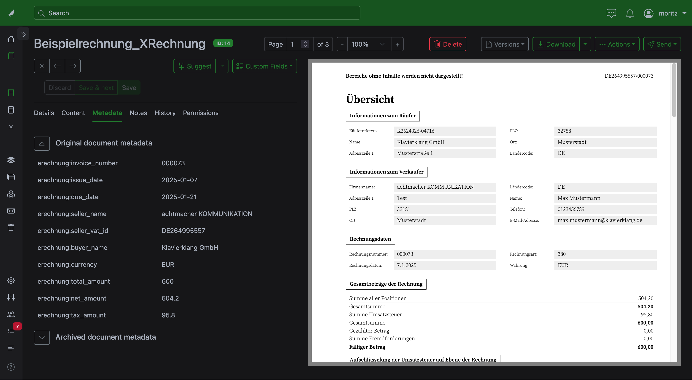

# paperless-ngx-erechnung

> [!WARNING]
> This plugin only works with Paperless-ngx v3.0 or greater. At the time of publication, this version of Paperless-ngx hasn't been released as a stable version. To test this plugin you need to run the `beta` branch of Paperless-ngx.

German E-Rechnung parser plugin for [Paperless-ngx](https://github.com/paperless-ngx/paperless-ngx).

Handles the two formats produced by the German B2B E-Rechnung mandate and makes their data visible and searchable in Paperless-ngx:

- **XRechnung** — pure XML invoice (UBL Invoice, UBL CreditNote, or UN/CEFACT CII).
- **ZUGFeRD / Factur-X** — hybrid PDF/A-3 with an embedded XML invoice.



## How it plugs in

Paperless-ngx exposes a parser plugin framework that scans the `paperless_ngx.parsers` Python entry-point group on startup (see `paperless/parsers/registry.py` in paperless-ngx). This package declares two parsers under that group:

| Parser             | MIME types                          | Score |
|--------------------|-------------------------------------|-------|
| `XRechnungParser`  | `application/xml`, `text/xml`       | 100   |
| `ZUGFeRDParser`    | `application/pdf`                   | 100   |

Both parsers gate their `score()` on content inspection — XRechnung confirms the root element namespace, ZUGFeRD looks for an embedded `factur-x.xml` / `ZUGFeRD-invoice.xml`. When the file does **not** match, `score()` returns `None` and Paperless's built-in parsers take over normally.

Built-in parsers score `10`; this plugin scores `100`, so it cleanly outranks defaults for matching files without affecting anything else.

## What this plugin does

- Archive PDF rendering for XRechnung via the official KoSIT [XRechnung-Visualization](https://github.com/itplr-kosit/xrechnung-visualization) XSLT (`xr-pdf.xsl`) plus Apache FOP (XSL-FO → PDF).
- Pass-through archive for ZUGFeRD PDFs (preserves PDF/A-3 conformance and the Factur-X signature).
- Extracted invoice fields (number, date, due date, seller, totals, …) surfaced in Paperless's metadata sidebar and prepended to the searchable text body.

## What this plugin does NOT do

- Creating Custom Fields (no plugin hook for this exists yet) from XML invoice fields
- Generation / creation of E-Rechnungen (Paperless-ngx is not a data entry tool)
- OCR fallback for scanned/non-Factur-X PDFs — those continue to use Paperless's built-in Tesseract path.

## Vendored KoSIT assets

`src/paperless_ngx_erechnung/xslt/` contains a pinned snapshot of the [KoSIT XRechnung-Visualization project](https://projekte.kosit.org/xrechnung/xrechnung-visualization) (Apache-2.0): the XSLT stylesheets, the Apache FOP configuration (`conf/fop.xconf`), and the Source Serif Pro TTF fonts (`conf/fonts/`, SIL OFL) that the FOP config registers. See `xslt/README.md` for the pinned version and re-vendoring instructions.

## Installation

```bash
pip install paperless-ngx-erechnung
```

Inside the Paperless-ngx Docker image, mount the package in or build a custom image that adds the install step. Paperless picks the plugin up at startup — look for `Loaded third-party parser 'XRechnung' …` in the logs.

## Development

Archive PDF rendering shells out to **Apache FOP**, which needs a JRE. The Dockerfile installs both (`default-jre-headless` + `fop`). For local development, install via your package manager:

```bash
brew install fop          # macOS — pulls in openjdk
apt install fop           # Debian/Ubuntu — pulls in default-jre-headless
```

The XSLT-dependent rendering tests skip if the `fop` binary is not on PATH. All other runtime dependencies (qpdf for pikepdf, libxml2/libxslt for lxml, libpdfium, Saxon-HE native libs, Pillow) are bundled in their respective wheels and need no system install.

Then:

```bash
uv sync
uv run pytest
```

## AI Disclaimer

This plugin was developed with the help of an AI Agent (Claude Code). However, it was not "vibecoded" (as in "a human did not look at or understand this code") or "one-shotted". Every line of this code was reviewed by a capable developer and the whole project is tested, refined and documented by real humans.

## License

GPL-3.0-only — matching Paperless-ngx itself, since this plugin runs in-process with Paperless and the combined work is most cleanly distributed under a single license. See `LICENSE` for the full text.

Bundled KoSIT XSLT under `src/paperless_ngx_erechnung/xslt/` is Apache-2.0 (GPL-3.0-compatible); see `src/paperless_ngx_erechnung/xslt/LICENSE`.
